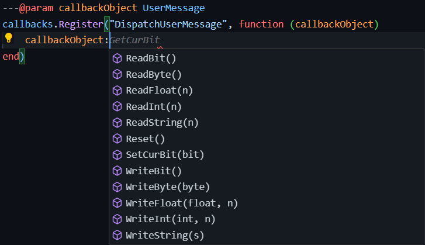

# Lmaobox Lua Annotations

Based on August 02 2023 update

> ***Lmaobox development just got a whole lot better*** 🧠 - LewdDeveloper

## Installation guide

### Visual Studio Code

1. Install the [LUA Extenstion](https://marketplace.visualstudio.com/items?itemName=sumneko.lua) for VSCode
2. Clone or download and extract this repo
3. Open VSCode and click on File -> Preferences -> Settings
4. On the left side, click Extensions -> Lua
5. Find **Workspace: Library** and click on **Add Item**
6. Select the **library** folder of this repo

---

You should now get autocomplete for all the functions and methods in the library folder.
It should look like this:

## How to use annotations

[Lua Language Server Wiki](https://github.com/LuaLS/lua-language-server/wiki)

## Console commands

| Command | Description |
| - | - |
| lua_tc | Toggle lua evaluation mode |
| lua_load ***PATH*** | Load a lua script in localappdata folder |
| lua_exec ***CODE*** | Evaluate lua code |
| lua | Same as lua_exec |
