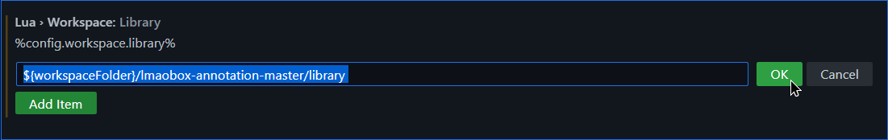
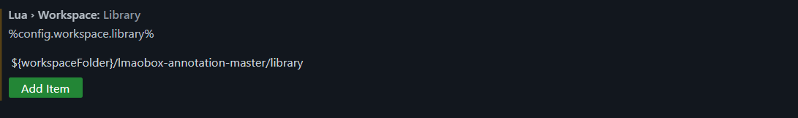
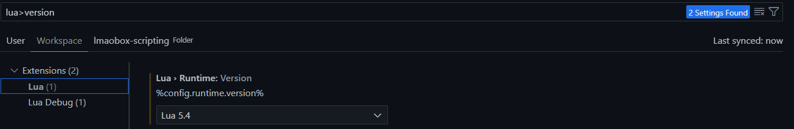
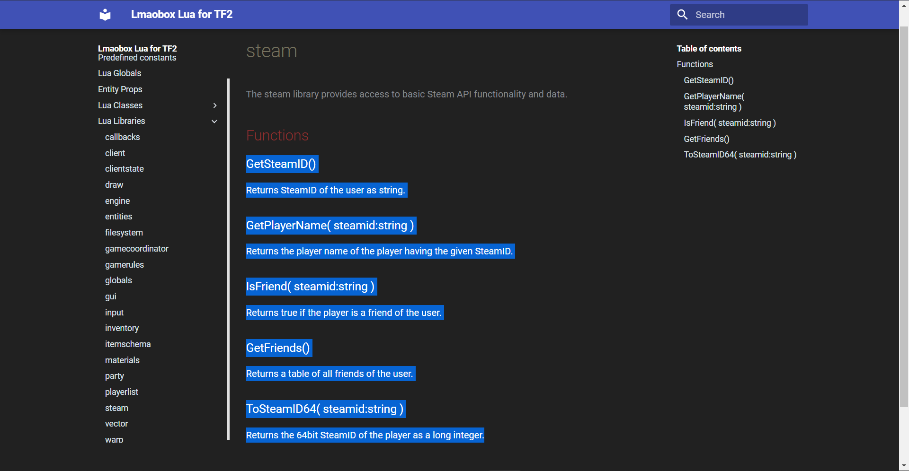
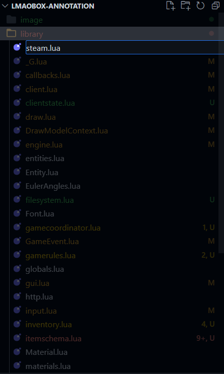

# Lmaobox Lua Annotations

> ***Lua development just got a whole lot better*** 🧠 - sumneko

## Document Version

Based on 22 Nov 2022 Update

## Dumb Installation guide

### Visual Studio Code

1. Download this repo and extract it to your workspace/folder
2. Install extension : [https://github.com/sumneko/lua-language-server#visual-studio-code](https://github.com/sumneko/lua-language-server#visual-studio-code)
3. Show All Command > Preferences: open Settings (UI)
4. Add library PATH in workspace/folder extension's setting

Shh, **${workspaceFolder}** is a [variable](https://code.visualstudio.com/docs/editor/variables-reference) in vscode

---

If you managed to setup correctly, confetti for you 🎉

Enjoy.

## Adding more annotations

To know more about annotations, refer to this wiki

> [https://github.com/sumneko/lua-language-server/wiki/Annotations](https://github.com/sumneko/lua-language-server/wiki/Annotations)

Shortcut to make life easier**™**

1. 
2. 
3. [**https://youtu.be/R4jODwUCuMg**](https://youtu.be/R4jODwUCuMg)

## TODO

Call every possible function/methods and inspect it's return value.

Find a dedicated maintainer.

Document built-in Console vars

|                   | What it do[🤔](https://emojipedia.org/thinking-face/) |
| ----------------- | -------------------------------------------------- |
| lua_tc            | Toggle lua interactive console                     |
| lua_load [[path]] | Load a lua script in localappdata folder           |
| lua_exec [[code]] | evaluate lua code                                 |
| lua               | same as lua_exec                                   |
